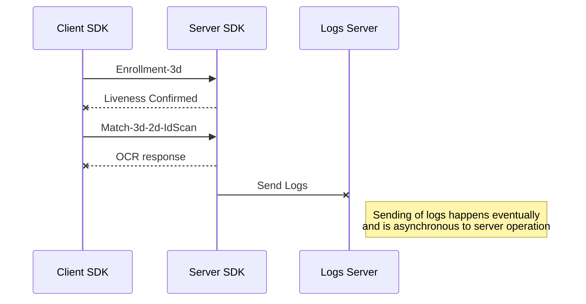

  
# Wallet-facetec-sdk-server-backend

<!-- TABLE OF CONTENTS -->
<details>
  <summary>Table of Contents</summary>
  <ol>
    <li>
      <a href="#about-the-project">About The Project</a>
      <ul>
        <li><a href="#built-with">Built With</a></li>
        <li><a href="#facetec-sdk">Facetec SDK</a>
		<ul>
			<li><a href="#features">Features</a></li>
			<li><a href="#integration">Integration</a></li>
		</ul>
		</li>
      </ul>
    </li>
    <li>
      <a href="#getting-started">Getting Started</a>
      <ul>
        <li><a href="#prerequisites">Prerequisites</a></li>
        <li><a href="#installation">Installation</a></li>
      </ul>
    </li>
    <li><a href="#usage">Usage</a>
      <ul>
        <li><a href="#facetec-servers">Facetec Servers</a></li>
        <li><a href="#docker-bundle-config">Docker bundle config</a></li>
        <li><a href="#facetec-server-custom">Facetec Server Custom</a></li>
        <li><a href="#usage-logs">Usage logs</a></li>
         <li><a href="#usage-logs">OCR templates</a></li>
      </ul>
   </li>
    <li><a href="#facetec-response-documentation">Facetec Response Documentation</a></li>
    <li><a href="#sequence-diagram">Sequence Diagram</a></li>
    <li><a href="#contact">Contact</a></li>
  </ol>
</details>


<!-- ABOUT THE PROJECT -->
## About The Project


This project is for storing all the related code resources to our **Custom Server Facetec** Implementation, also incluedes all configuration related files needed for the **Custom Implementation** to arise. :computer:

In the bellow sections we'll explain in detail the content of every folder of this implementation.

It's important to notice that we're strongly referencing the official 
[FaceTec Developer Documentation - FaceTec](https://dev.facetec.com/)

From there we're referencing concepts such as
* Custom Server
* Usage Logs Server
* Docker configuration

Feel free to contribute to the `README.md` to explain more in detail. :smile:

# FaceTec SDK
The FaceTec SDK is a facial recognition software development kit that provides a secure and user-friendly way to authenticate users. The SDK uses 3D Face Authentication to verify user identity, which provides a high level of security and eliminates the need for passwords or other traditional authentication methods.

The FaceTec SDK can be used in a variety of industries, including banking, healthcare, e-commerce, and more. It can be integrated into mobile apps, web applications, and desktop software to provide secure and easy-to-use authentication solutions.

## Features
The FaceTec SDK includes a variety of features that make it a powerful and user-friendly authentication solution:

- 3D Face Authentication: The SDK uses 3D Face Authentication to verify user identity, which provides a high level of security and eliminates the need for passwords or other traditional authentication methods.
- Liveness Detection: The SDK includes liveness detection to prevent fraud by ensuring that the person being authenticated is physically present and not a photograph or video.
- User Feedback: The SDK provides user feedback during the authentication process to ensure that users are properly positioned and lit for optimal facial recognition.
- Seamless Integration: The SDK is easy to integrate into mobile apps, web applications, and desktop software.
### Integration
- To integrate the FaceTec SDK into your application, you must register on the FaceTec website and obtain the necessary credentials to use the SDK. Once you have the credentials, you can integrate the SDK into your app using the documentation and code examples provided by FaceTec.


<p align="right">(<a href="#readme-top">back to top</a>)</p>

### Built With

For building and deploying this project we're using a little diverse technology stack
* Docker
* Java
* Javascript

And also there's heavy usage for 
* YAML configuration files

<p align="right">(<a href="#readme-top">back to top</a>)</p>

<!-- GETTING STARTED -->
## Getting Started

For having this project to run is required to have installed a few prerequisites

### Prerequisites

* [Docker & Docker Compose](https://www.docker.com/)
* [Node.js](https://nodejs.org/en/)
* [OCR Template Creator - FaceTec](https://dev.facetec.com/ocr-template-creator)

### Local Installation

_Facetec Require us to download a few resources._

1. Get Custom Server SDK files with Wizard at [Downloads - FaceTec](https://dev.facetec.com/downloads)
2. Clone the repo
   ```sh
   git clone git@github.com:Millicom-MFS/wallet-facetec-sdk-server-backend.git
   ```
3. Install config files
	
	Copy **config.yaml** files from downloaded SDK to the folders:
	
	**facetec_usage_logs_server -> facetec-servers\facetec_usage_logs_server**
	
	**FaceTecSDK-custom-server-[version-number] ---> facetec-servers\FaceTecSDK-custom-server-[version-number]**
	
	
4. Run containers
   ```sh
   docker compose build & docker compose up
   ```
   
5. Certify that the app is running properly

> **Note:** Consider specifications for **Docker** in your specific platform 

<p align="right">(<a href="#readme-top">back to top</a>)</p>


<!-- USAGE EXAMPLES -->
## Usage

This sections speaks briefly about each folder included in this project.
We're strongly referencing concepts from [FaceTec - Developer Account](https://dev.facetec.com/) so please request for further explanation if it's not enough clear.

### Facetec Servers 

Facetec Server folder stores the files related to server code and it's implementation.

- Docker bundle config
- Facetec Server Custom
- Usage Logs
- OCR Templates

### Docker bundle config

This section is located in the main path of the Facetec Server Folders and includes the basic configuration files needed for Facetec to Operate.

- build.sh
- compile.sh
- run.sh
- docker-compose.yml
- Dockerfile

As described in the Installation section we're using docker in order to deploy the application locally and remotely.

### Facetec Server Custom

This folder contains the necessary code for running the REST Facetec Server that allows proper communication with Facetec Core for allowing the processes needed for our operation:

- Liveness check (Enrollment-3d)
- Match ID  (Match-3d-2d-IdScan)

### Usage logs
This folder contains the code that allows usage logs server to run properly, this code is mainly for compliance and billing purposes for our provider so it's mostly upgraded when a new version arises.
This code **SHOULDN'T BE EDITED** in order to comply with Facetec Politics.

### OCR Templates
This folder stores the Current and Custom OCR Templates Configurated by OCR Template Creator via Facetec Tool.

This Files include the necessary templates for the correct operation of TOP Countries allowed for **Panama Operation** which are:

- Argentina
- Colombia
- Costa Rica
- El Salvador
- México
- Nicaragua
- Venezuela

For specific use case of Panamá we're considering support for passport for every country.


# Facetec Response Documentation

This document explains the structure of the response object returned by the Facetec API.

- `"_id"`: Unique ID of the response object.
- `"idScanAgeEstimateGroupEnumInt"`: Age group.
- `"externalDatabaseRefID"`: Tuple reference.
- `"matchLevel"`: Match level. See more at https://dev.facetec.com/matching-guide.
- `"fullIDStatusEnumInt"`: Full ID status. 0 = FULL_ID_DETECTED, 1 = COULD_NOT_CONFIDENTLY_DETERMINE_FULL_ID_USER_NEEDS_TO_RETRY.
- `"digitalIDSpoofStatusEnumInt"`: Digital ID spoof status. 0 = LIKELY_PHYSICAL_ID, 1 = COULD_NOT_CONFIDENTLY_DETERMINE_PHYSICAL_ID_USER_NEEDS_TO_RETRY.
- `"scanResultBlob"`: Unused in this collection.
- `"nfcStatusEnumInt"`: NFC status. 0 = NO_NFC_SPECIFIED_BY_TEMPLATE, 1 = NFC_REQUESTED_BUT_DEVICE_NOT_CAPABLE, 2 = NFC_REQUESTED_BUT_USER_PRESSED_SKIP, 3 = NFC_REQUESTED_BUT_ERROR_ACCESSING_CHIP, 4 = SUCCESS.
- `"barcodeStatusEnumInt"`: Barcode status. 0 = NO_BARCODE_SPECIFIED_BY_TEMPLATE, 1 = BARCODE_REQUESTED_BUT_NOT_FOUND, 2 = BARCODE_REQUESTED_BUT_ERROR_READING, 3 = SUCCESS.
- `"faceOnDocumentStatusEnumInt"`: Face on document status. 0 = NOT_AVAILABLE, 1 = LIKELY_ORIGINAL_FACE, 2 = CANNOT_CONFIRM_ID_IS_AUTHENTIC.
- `"textOnDocumentStatusEnumInt"`: Text on document status. 0 = NOT_AVAILABLE, 1 = LIKELY_ORIGINAL_TEXT, 2 = CANNOT_CONFIRM_ID_IS_AUTHENTIC.
- `"matchLevelNFCToFaceMap"`: Match level.
- `"success"`: Result of the transaction.
- `"wasProcessed"`: Transaction was processed.
- `"callData"`: Call data object.
  - `"tid"`: Transaction ID.
  - `"path"`: Endpoint.
  - `"date"`: Date.
  - `"epochSecond"`: Epoch time.
  - `"requestMethod"`: Method type.
- `"additionalSessionData"`: Additional session data object.
  - `"isAdditionalDataPartiallyIncomplete"`: Is data incomplete.
  - `"platform"`: OS device.
  - `"appID"`: App ID.
  - `"installationID"`: Installation ID.
  - `"deviceModel"`: Device model.
  - `"deviceSDKVersion"`: SDK version.
  - `"sessionID"`: Session ID.
  - `"userAgent"`: User agent.
  - `"ipAddress"`: IP address.
- `"error"`: Error status.

### Server Info

- `coreServerSDKVersion`: The version of the SDK core.
- `customOrStandardServerSDKVersion`: The version of the SDK.
- `type`: The type of server.
- `mode`: The mode of the server.

### Data

- `idScan`: The ID of the scan.
- `idScanFrontImage`: The ID of the front image.
- `idScanBackImage`: The ID of the back image.
- `photoIDBackCrop`: The ID of the back crop.
- `photoIDFrontCrop`: The ID of the front crop.
- `photoIDFaceCrop`: The ID of the face crop.
- `photoIDPrimarySignatureCrop`: The ID of the primary signature crop.
- `photoIDSecondarySignatureCrop`: The ID of the secondary signature crop (if it exists).
- `extractedNFCImage`: The NFC image.
- `autoExtractedOCRData`: An object containing the following fields:
  - `firstName`: The first name.
  - `lastName`: The last name.
  - `dateOfExpiration`: The date of expiration of the ID.
  - `dateOfIssue`: The date of issue of the ID.
  - `dateOfBirth`: The date of birth.
  - `middleName`: The middle name.
  - `idNumber`: The ID number.
- `templateInfo`: An object containing the following fields:
  - `templateName`: The name of the template used.
  - `templateType`: The type of the template.
- `photoIDTamperingEvidenceFrontImage`: The ID of the front image used for tampering evidence.
- `photoIDTamperingEvidenceBackImage`: The ID of the back image used for tampering evidence.

### Enrollment Session

- `$oid`: The ID of the enrollment session.

### ID Scan Session ID

- The ID of the ID scan session.

#####  Facetec's answer in JSON format: A detailed look at biometric identification


## Sequence diagram

Currently you can see our sequence Diagram to map briefly the interactions for this implementation.



<!-- CONTACT -->
## Contact

For further explanation and suggestions to this file or the implementation 
feel free to reach.

Engineering Lead - Mario Meza - mario.meza@millicom.com

<p align="right">(<a href="#readme-top">back to top</a>)</p>
